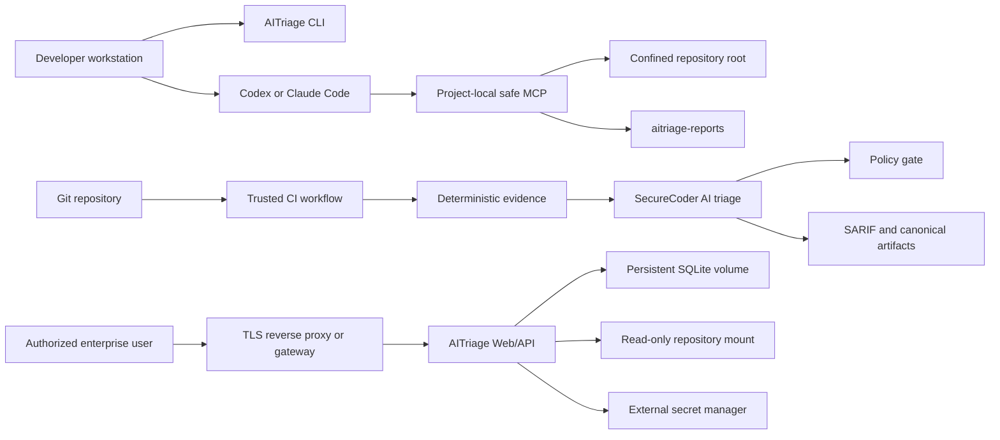

# AITriage

Security scanning and AI triage for source code, local AI IDEs, and CI/CD.

[](https://github.com/cybertortuga/aitriage/releases)
[](LICENSE)
[](https://go.dev/)
[](https://github.com/cybertortuga/aitriage/actions)
[](https://github.com/cybertortuga/aitriage/pkgs/container/aitriage)

AITriage combines deterministic scanners with the SecureCoder AI-triage pipeline. It detects security problems, removes false positives through contextual analysis, produces fix specifications, and applies a security gate.

## Documentation map

- [Quick start](#quick-start)
- [Product surfaces and support status](#product-surfaces-and-support-status)
- [Choose the right workflow](#choose-the-right-workflow)
- [Install AITriage](#install-aitriage)
- [Use AITriage from an AI IDE](#use-aitriage-from-an-ai-ide)
  - [Codex setup](#codex-setup)
  - [Claude Code setup](#claude-code-setup)
  - [Install through your AI IDE](#install-through-your-ai-ide)
  - [Troubleshooting](#troubleshooting-ai-ide-setup)
- [Initialize a repository](#initialize-a-repository)
- [Deterministic CLI scanning](#deterministic-cli-scanning)
- [Standalone AI triage](#standalone-ai-triage)
- [CI/CD](#cicd)
- [Enterprise production deployment](#enterprise-production-deployment)
  - [Production status](#production-status)
  - [Architecture](#enterprise-architecture)
  - [Deployment requirements](#production-deployment-requirements)
  - [Operations runbook](#operations-runbook)
  - [Go-live checklist](#production-go-live-checklist)
- [Production rollout plan](#production-rollout-plan)
- [Security policy](#security-policy)
- [Rules and scanners](#rules-and-scanners)
- [MCP technical reference](#mcp-technical-reference)
- [Web and terminal interfaces](#web-and-terminal-interfaces)
- [Development](#development)
- [Contributing](#contributing)

## Quick start

### Local scan in one minute

```bash
brew install cybertortuga/aitriage/aitriage
cd /path/to/repository
aitriage scan .
```

This produces deterministic findings without an LLM or API key.

### Full AI triage with a Codex subscription

```bash
cd /path/to/repository
aitriage install-codex .
```

Open a new Codex task at the repository root and ask:

```text
Check this repository with AITriage. Do not fix anything; show me the result.
```

### Full AI triage with a Claude subscription

```bash
cd /path/to/repository
aitriage install-claude-code .
```

Open a new Claude Code session at the repository root and use the same request.

### CI/CD

Copy [the canonical GitHub Actions workflow](examples/github-actions/aitriage-security.yml) to `.github/workflows/aitriage.yml`, configure the required provider secret, and follow the [CI/CD setup checklist](#install-the-github-actions-workflow).

## Product surfaces and support status

| Surface | Intended use | Current status |
| :--- | :--- | :--- |
| CLI scanner | Local deterministic scanning | Supported local/automation path |
| GitHub Actions | Mandatory AI triage and security gate | Recommended CI/CD path |
| Codex MCP `safe` profile | Subscription-backed local triage | Project-confined local path |
| Claude Code MCP `safe` profile | Subscription-backed local triage | Project-confined local path |
| Web dashboard | Shared browser UI and SQLite data | Internal evaluation only; not Internet-facing production today |
| SSE MCP / LangGraph companion | Remote or custom agent integration | Advanced/experimental; secure externally before use |

The production status of one surface does not automatically apply to another. In particular, the local `safe` MCP profile has a repository confinement boundary, while the current Web dashboard intentionally runs as an open single-user/local interface and has separate network-deployment limitations documented below.

## Choose the right workflow

| Goal | Command or entry point | AI source | API key |
| :--- | :--- | :--- | :--- |
| Scan code quickly | `aitriage scan .` | No AI | Not required |
| Run full triage from Codex | AITriage MCP | Your Codex subscription | Not required |
| Run full triage from Claude Code | AITriage MCP | Your Claude subscription | Not required |
| Run standalone AI triage | `aitriage agent .` | Configured LLM provider | Required |
| Run in CI/CD | GitHub Actions workflow | Configured CI provider | Required as a CI secret |

> `aitriage scan` is a deterministic pre-scan. It is not the final AI-triaged security verdict. Use the MCP workflow or `aitriage agent` when you need contextual TP/FP/Needs-Review classification, reports, and a policy gate.

## Install AITriage

### Homebrew

```bash
brew install cybertortuga/aitriage/aitriage
```

### Go

Requires Go 1.25.5 or newer:

```bash
go install github.com/cybertortuga/aitriage/cmd/aitriage@latest
```

Verify the installation:

```bash
aitriage version
aitriage --help
```

## Use AITriage from an AI IDE

This is the recommended local workflow for Codex and Claude Code. AITriage runs its existing SecureCoder prompts and uses the model already available through your AI IDE subscription. You do not configure a separate LLM API key.

### How the flow works

```text
User request
  → AITriage deterministic scan
  → SecureCoder prompts sent through MCP
  → Codex or Claude answers with its subscription model
  → AITriage validates the answers
  → report + fix specification + security gate
  → user decides whether anything may be changed
```

AITriage never treats a failed gate as permission to edit source code.

### Codex setup

Run once from the repository root:

```bash
cd /path/to/repository
aitriage install-codex .
```

The installer:

- creates or updates `.codex/config.toml` for this repository;
- starts AITriage with the `safe` MCP profile;
- confines access to this repository root and its subdirectories;
- adds a managed AITriage contract to `AGENTS.md` without overwriting existing instructions.

After installation, open a **new Codex task** from the repository root. An already-open task may keep the previous MCP configuration and instructions.

### Claude Code setup

Run once from the repository root:

```bash
cd /path/to/repository
aitriage install-claude-code .
```

The installer:

- registers AITriage through the official `claude mcp add --scope local` flow when the Claude CLI is available;
- otherwise creates `.mcp.json` and clearly reports that approval is still pending;
- adds a managed AITriage contract to `CLAUDE.md` without overwriting existing instructions.

Start a new Claude Code session after installation.

### Run an audit

Ask your AI IDE in normal language:

```text
Check this repository with AITriage. Do not fix anything; show me the result.
```

For a nested project in a monorepo:

```text
Check services/payments with AITriage. Do not fix anything; show me the result.
```

The MCP is configured once at the repository root. Any real directory below that root can be selected without editing MCP configuration. Paths outside the root, `../` traversal, and symlink escapes are rejected.

### Approve fixes

The audit stops at user approval. To fix selected findings, continue in the same AI IDE task:

```text
Fix the confirmed AITriage findings CS-AUTH-001 and CS-AUTHZ-001, run the required tests, and verify them with AITriage.
```

Or explicitly authorize all confirmed True Positives:

```text
Fix all confirmed True Positives from the latest AITriage report and verify the result.
```

AITriage must not modify False Positives or Needs-Manual-Review findings unless the user makes a separate explicit decision.

### Generated artifacts

All local scan, triage, cache, and audit artifacts are stored in one directory at the configured repository root:

```text
aitriage-reports/
├── cache/
├── history/
└── run-YYYYMMDDTHHMMSS-xxxxxxxx/
    ├── manifest.json
    ├── scan.json
    ├── triage-findings.json
    ├── summary.md
    ├── report.md
    ├── fixspec.md
    ├── aitriage.sarif
    └── audit.log
```

Add this line to the repository `.gitignore` if it is not already present:

```gitignore
/aitriage-reports/
```

AITriage excludes `aitriage-reports/` from repository context so generated artifacts cannot restart or contaminate the next analysis stage.

### Install through your AI IDE

If the user does not want to run setup commands manually, copy this prompt into Codex or Claude Code from the repository root:

```text
Set up AITriage for this repository. Do not scan the project and do not modify source code yet.

1. Check whether the `aitriage` command is installed.
2. If it is missing and Homebrew is available, run:
   brew install cybertortuga/aitriage/aitriage
   If Homebrew is unavailable, stop and show me the official installation options.
3. If you are Codex, run: aitriage install-codex .
4. If you are Claude Code, run: aitriage install-claude-code .
5. Preserve existing AGENTS.md, CLAUDE.md, MCP configuration, and .gitignore content.
6. Ensure `/aitriage-reports/` is present in .gitignore without duplicating it.
7. Verify the MCP connection:
   - Codex: codex mcp get aitriage
   - Claude Code: claude mcp get aitriage
8. Tell me exactly what was created or changed. Do not start an audit until I ask.
```

After setup, start a new AI IDE task/session and ask it to check the project with AITriage.

### Update or remove the integration

Re-run the same install command to update the project-local entry:

```bash
aitriage install-codex .
aitriage install-claude-code .
```

Remove only the managed AITriage integration:

```bash
aitriage install-codex . --uninstall
aitriage install-claude-code . --uninstall
```

The uninstall flow preserves unrelated MCP servers and project-owned instruction text.

### Troubleshooting AI IDE setup

| Symptom | Action |
| :--- | :--- |
| AI IDE runs `aitriage scan` instead of full triage | Confirm `AGENTS.md` or `CLAUDE.md` contains the AITriage contract, then start a new task/session |
| Codex cannot see AITriage | Run `codex mcp get aitriage` from the repository root and confirm the project is trusted |
| Claude Code shows `Pending approval` | Open Claude Code in the repository and approve the project MCP server, or reinstall with the Claude CLI available |
| A nested project is not selected | Name its path relative to the configured repository root in the request |
| A path is rejected | It must resolve to a real directory inside the configured root |
| Full triage takes several minutes | The AI IDE is answering multiple SecureCoder stages; do not press Retry unless the task actually failed |
| Full triage fails | Report the failure; do not substitute raw `aitriage scan` output as the final result |

## Initialize a repository

`init` creates the standard configuration and AI-agent instruction files without overwriting existing files:

```bash
aitriage init .
```

Optional repository setup:

```bash
aitriage init . --ci                 # Add GitHub Actions workflow
aitriage init . --pre-commit         # Add staged pre-commit scanning
aitriage init . --ci --pre-commit    # Enable both
aitriage init . --mcp                # Wire both Codex and Claude Code
```

For a single AI IDE, prefer the targeted `install-codex` or `install-claude-code` command.

## Deterministic CLI scanning

No model or API key is required.

### Common scans

```bash
aitriage scan .                                  # Scan current repository
aitriage scan ./service                          # Scan a specific directory
aitriage scan . --format json                    # JSON output
aitriage scan . --format sarif -o results.sarif  # SARIF file
aitriage scan . --format html                    # HTML report
aitriage scan . -i                               # Interactive terminal UI
```

### Scan changed code

```bash
aitriage scan . --staged             # Git-staged changes
aitriage scan . --diff HEAD~1        # Changes since previous commit
aitriage scan . --diff origin/main   # Changes compared with main
```

### Watch mode

```bash
aitriage watch .
aitriage watch . --debounce 500
aitriage watch . --fail-on critical
```

### Baselines

```bash
aitriage baseline create .
aitriage baseline show .
aitriage baseline update .
aitriage baseline clear .
aitriage scan . --baseline
```

### Pre-commit

The generated hook scans staged changes only:

```bash
aitriage init . --pre-commit
```

Or configure the pre-commit framework:

```yaml
repos:
  - repo: https://github.com/cybertortuga/aitriage
    rev: v1.0.0
    hooks:
      - id: aitriage
      - id: aitriage-secrets
```

## Standalone AI triage

Use standalone mode when no supported AI IDE subscription is available or when automation requires a provider API.

```bash
aitriage agent .
aitriage agent . --no-chat
aitriage agent . --provider gemini --model gemini-2.5-pro
aitriage agent . --health-profile standard --fail-on any \
  --summary-out summary.md \
  --report-out report.md \
  --fixspec-out fixspec.md \
  --triage-out triage-findings.json
```

### Provider configuration

| Provider | Environment variable | Example model |
| :--- | :--- | :--- |
| Google Gemini | `GEMINI_API_KEY` | `gemini-2.5-flash` |
| Anthropic | `ANTHROPIC_API_KEY` | `claude-sonnet-4-5` |
| OpenAI-compatible | `OPENAI_API_KEY` | Provider-specific |
| Groq | `GROQ_API_KEY` | Provider-specific |
| Ollama | None | Locally configured model |

Never store an API key directly in `.aitriage.yaml` or source code. Reference an environment variable.

## CI/CD

The canonical CI workflow follows the same security logic as local full triage:

```text
deterministic evidence
  → SARIF and scan artifacts
  → mandatory SecureCoder AI triage
  → canonical summary/report/fixspec/inventory
  → post-AI policy gate
```

Raw scanner findings are evidence, not the final merge decision. The primary workflow fails closed if mandatory AI triage cannot complete.

### Install the GitHub Actions workflow

Copy [examples/github-actions/aitriage-security.yml](examples/github-actions/aitriage-security.yml) to `.github/workflows/aitriage.yml`.

Before the first run:

1. Configure the required LLM provider secret in GitHub Actions.
2. Create the `ai-triage` environment and restrict access as required by your organization.
3. Configure `AITRIAGE_ALLOWED_ACTOR_ID` when using the canonical actor allowlist.
4. Run the workflow manually once.
5. Make the post-AI triage job the required branch-protection check.

### Included workflow examples

| Workflow | Purpose |
| :--- | :--- |
| [aitriage-security.yml](examples/github-actions/aitriage-security.yml) | Recommended deterministic evidence + mandatory AI gate |
| [aitriage-pr-gate.yml](examples/github-actions/aitriage-pr-gate.yml) | Deterministic-only PR gate |
| [aitriage-ai-advisor.yml](examples/github-actions/aitriage-ai-advisor.yml) | Non-blocking AI advisory report |
| [aitriage-manual-html-report.yml](examples/github-actions/aitriage-manual-html-report.yml) | Manual HTML report |

## Enterprise production deployment

This section separates production-capable workflows from the current Web dashboard limitations. Read [Production status](#production-status) before exposing any service.

### Production status

The CLI, CI/CD workflow, and project-local `safe` MCP profile can be deployed without exposing the AITriage Web API to the network.

The current Web dashboard is intentionally operated without a login requirement. It must **not** be exposed directly to the Internet or a broad corporate network. The repository currently contains these production blockers:

- `AuthMiddleware` is not attached to the Web server;
- `PermissionMiddleware` is intentionally a pass-through;
- missing authentication context receives a synthetic administrative identity for the local UI;
- the database login/JWT/default-user code is a legacy dormant scaffold and does not protect the running Web API;
- CORS is configured with `Access-Control-Allow-Origin: *`;
- the reference compose file mounts the scan root writable;
- rate limiting is process-global rather than identity/IP aware;
- the reference compose stack does not provide TLS termination, centralized secrets, HA, or automated backups.

Treat `make up`, `make launch`, and `make enterprise-up` as local/internal evaluation commands until every P0 item in the [Production rollout plan](#production-rollout-plan) is complete and independently verified.

### Enterprise architecture

Recommended production separation:



Production trust boundaries:

- local MCP receives only paths inside its configured repository root;
- the AI IDE supplies model responses, while AITriage owns prompts, validation, artifacts, and gate state;
- CI provider credentials live only in the CI secret store;
- the Web/API, if enabled after hardening, sits behind TLS and an external identity-aware access gateway, or uses a separately enabled and fully tested internal authentication/RBAC implementation;
- scanned repositories should be mounted read-only wherever source modification is not explicitly required;
- `aitriage-reports/` and the SQLite database are sensitive security artifacts and require controlled access and retention.

### Production deployment requirements

#### Platform requirements

- Linux host or Kubernetes/container platform with a supported Docker runtime;
- persistent storage for `/app/data` when the Web dashboard is used;
- read-only access to repositories being scanned;
- outbound HTTPS access only to explicitly approved LLM/scanner endpoints;
- a TLS reverse proxy or gateway;
- a secret manager or protected runtime secret injection;
- centralized logs and health monitoring;
- tested backup and rollback procedures.

AITriage does not publish an HA/SLA guarantee for the SQLite Web deployment. Run one Web writer instance per SQLite volume. Use CLI/CI workers for horizontally scalable scanning rather than sharing one SQLite file across replicas.

#### Image policy

Never deploy `latest` in production. Pin a reviewed release tag or immutable digest:

```text
ghcr.io/cybertortuga/aitriage:<reviewed-version>
ghcr.io/cybertortuga/aitriage@sha256:<reviewed-digest>
```

Record the image identity, configuration revision, rule-pack versions, and LLM model in the change ticket.

#### Required secrets

For CLI/CI provider-backed triage, supply only the approved LLM provider keys required by the deployment.

- optional observability credentials only when their destination is approved;
- gateway/session secrets when an external access gateway is used;
- a unique high-entropy `JWT_SECRET` only if the dormant internal authentication path is deliberately enabled and tested.

Setting `JWT_SECRET` or changing the seeded `admin` password does **not** enable authentication in the current open Web mode.

Generate a JWT secret outside the repository:

```bash
openssl rand -hex 32
```

Do not put the result in `.env`, compose files, GitHub variables, logs, or command history. Inject it from the platform secret store.

#### Network controls

- Bind the Web container to loopback or a private service network.
- Expose it only through the approved TLS gateway.
- Restrict egress to required provider and scanner endpoints.
- Do not publish MCP SSE directly without authentication, TLS, and network policy.
- Restrict `/api/health` externally if platform policy requires it.

#### Repository mounts

For audit-only workloads, mount source read-only:

```text
/srv/repositories:/host:ro
```

Do not mount `/`, a developer home directory, Docker socket, SSH directory, cloud credentials, or unrelated repository roots into the service.

### Reference internal deployment

The repository compose stack is useful for isolated evaluation only:

```bash
cp .env.example .env
# Replace every development value before starting.
make up
curl -fsS http://127.0.0.1:8080/api/health
docker compose logs --tail=100 web
```

Stop it with:

```bash
make down
```

The current local Web mode has no required login. Do not assume the legacy `admin` record or `JWT_SECRET` protects it. Do not use wildcard CORS or the writable source mount as a production configuration.

### Operations runbook

#### Health check

```bash
curl -fsS http://127.0.0.1:8080/api/health
docker compose ps
```

A healthy HTTP response proves process availability, not that authentication, the LLM provider, external scanners, storage, and backups are correctly configured. Monitor those dependencies separately.

#### Logs

```bash
docker compose logs -f --tail=200 web
```

Production logs must be shipped to controlled storage. Do not log source contents, model credentials, full secrets, authorization cookies, or unredacted scanner evidence.

Set telemetry policy explicitly:

```bash
AITRIAGE_TELEMETRY=off
```

Use the value required by your privacy policy; do not rely on an ambient default.

#### Run artifact retention

Inspect local run status before cleanup:

```bash
aitriage runs list .
aitriage runs clean . --dry-run
aitriage runs clean .
```

Use `--force` only when unfinished runs are intentionally being removed. Apply a retention policy to `aitriage-reports/`, SARIF, CI artifacts, logs, and model audit data.

#### SQLite backup

For the reference named volume, stop the Web writer and create a consistent archive:

```bash
mkdir -p backups
docker compose stop web
docker run --rm \
  -v aitriage_sqlite_data:/data:ro \
  -v "$PWD/backups:/backup" \
  alpine sh -c 'tar czf /backup/aitriage-data.tgz -C /data .'
docker compose start web
```

Store backups encrypted and outside the Docker host. Test restoration on an isolated environment.

#### SQLite restore

Restore is destructive. Confirm the exact backup and target volume before running it:

```bash
docker compose down
docker run --rm \
  -v aitriage_sqlite_data:/data \
  -v "$PWD/backups:/backup:ro" \
  alpine sh -c 'rm -rf /data/* && tar xzf /backup/aitriage-data.tgz -C /data'
docker compose up -d web
curl -fsS http://127.0.0.1:8080/api/health
```

#### Upgrade

1. Read release notes and review dependency/rule changes.
2. Pin the new image tag or digest.
3. Back up persistent data and export current configuration.
4. Deploy to staging using representative repositories.
5. Run health checks and a known-result security scan.
6. Verify the external access gateway or the separately enabled internal auth path, plus reports, CI artifacts, and provider connectivity.
7. Promote the exact tested image identity.

#### Rollback

1. Stop new scans and preserve failed-run evidence.
2. Restore the previous pinned image.
3. If a data migration is incompatible, restore the pre-upgrade database backup.
4. Re-run health checks and the known-result scan.
5. Document the incident and block the failed release.

### Production go-live checklist

Do not approve an Internet-facing Web deployment until every item is checked:

- [ ] An external identity-aware gateway protects every Web/API route, or internal authentication has been explicitly enabled and tested.
- [ ] Authorization is deny-by-default at the chosen gateway or application layer.
- [ ] Missing/invalid identity never receives synthetic admin privileges in networked mode.
- [ ] Operators understand that the legacy `admin` user and `JWT_SECRET` do not protect the current open mode.
- [ ] CORS uses an explicit allowlist; wildcard origin is removed.
- [ ] Cookies/tokens have Secure, HttpOnly, SameSite, expiry, and rotation controls.
- [ ] TLS is terminated by an approved gateway; direct container ports are private.
- [ ] JWT and LLM secrets come from a secret manager and have rotation owners.
- [ ] Source repositories are mounted read-only and scoped narrowly.
- [ ] Container image is pinned by reviewed version or digest.
- [ ] Global/per-IP rate limits and upstream abuse controls are tested.
- [ ] Security headers and CSP are validated in the deployed response.
- [ ] Health, logs, disk, provider errors, and scan failures have alerts.
- [ ] Backup and destructive restore are tested on an isolated environment.
- [ ] Upgrade and rollback are rehearsed with a known-result repository.
- [ ] CI uses mandatory post-AI gating and protected provider secrets.
- [ ] Retention is defined for SQLite, `aitriage-reports/`, SARIF, and logs.
- [ ] A security review confirms no default credentials or broad mounts remain.

## Production rollout plan

Use staged adoption. Each stage has an explicit exit criterion and can be rolled back independently.

### Phase 0 — Isolated evaluation

**Actions**

1. Run [deterministic CLI scans](#deterministic-cli-scanning) on test repositories.
2. Validate expected findings, secret redaction, runtime, and artifact volume.
3. Define data classification and retention for reports.

**Exit criteria**

- expected test findings are detected;
- no source files are modified by audit-only commands;
- artifacts contain no unredacted secrets;
- owners accept the initial false-positive/noise profile.

### Phase 1 — Local AI IDE pilot

**Actions**

1. Install the [Codex or Claude Code MCP integration](#use-aitriage-from-an-ai-ide) in a limited repository set.
2. Run audit-only prompts first.
3. Require explicit user approval before any fixes.
4. Review TP/FP/Needs-Review quality and duplicate findings.

**Exit criteria**

- the agent always starts with `aitriage_run_start` rather than raw scan;
- nested repositories remain confined to the configured root;
- canonical artifacts are created under `aitriage-reports/`;
- the run stops at `awaiting_user_approval` for audit intent;
- approved fixes are re-verified before completion.

### Phase 2 — Advisory CI

**Actions**

1. Install the [canonical workflow](#install-the-github-actions-workflow).
2. Store provider keys in protected CI secrets.
3. Publish SARIF and canonical triage artifacts without blocking merges initially.
4. Measure runtime, cache hit rate, cost, and noise.

**Exit criteria**

- trusted triggers and actor restrictions are verified;
- provider failure is visible and fails the mandatory triage job closed;
- repeated runs use deterministic cache keys;
- security owners approve the gate policy.

### Phase 3 — Mandatory CI gate

**Actions**

1. Enable the selected [security policy](#security-policy).
2. Make the post-AI triage job a required check.
3. Add ownership and an exception process for blocked releases.

**Exit criteria**

- branch protection cannot bypass the required check through normal developer permissions;
- the exception process is auditable;
- incident and rollback owners are assigned.

### Phase 4 — Internal Web pilot

This phase is blocked until all Web P0 items under [Production status](#production-status) are fixed and tested.

**Actions**

1. Deploy only to an isolated private environment.
2. Put the open Web UI behind an identity-aware gateway, or implement and test application authentication plus deny-by-default RBAC.
3. Remove wildcard CORS, synthetic admin fallback in networked mode, and writable broad mounts.
4. Test backup, restore, upgrade, rollback, and audit logging.

**Exit criteria**

- every item in the [production go-live checklist](#production-go-live-checklist) passes;
- independent security review approves the deployment;
- operational ownership and support coverage are documented.

### Phase 5 — Production operations

**Actions**

1. Promote the exact tested image digest.
2. Enable monitoring, alerts, backups, and retention jobs.
3. Review access, provider use, scan quality, and upgrade status regularly.

**Exit criteria**

- SLOs and incident paths are agreed by service owners;
- restore and rollback remain tested;
- no unresolved critical production blocker remains.

## Security policy

AITriage calculates a security score and a separate policy verdict.

| Profile | Behavior |
| :--- | :--- |
| `baseline` | Blocks active critical and high findings; score is informational |
| `standard` | Requires score 70 or higher and blocks active critical/high findings |
| `strict` | Requires score 90 or higher and blocks active critical/high/medium findings |

Example `.aitriage.yaml`:

```yaml
health_check:
  profile: baseline
  fail_on: critical
  minimum_score: 0
  max_critical: -1
  max_high: -1
  max_medium: -1
  block_sources: []
  block_classes: []
```

See [`.aitriage.yaml.example`](.aitriage.yaml.example) for all options.

## Rules and scanners

AITriage includes built-in checks for:

- authentication and authorization gaps;
- hardcoded secrets and credentialed connection strings;
- input validation, SQL injection, XSS, SSRF, CSRF, and path traversal;
- insecure CORS and missing security headers;
- missing rate limiting and unsafe error handling;
- vulnerable Docker and infrastructure configuration;
- AI-generated code residue and unsafe LLM integrations;
- dependency and supply-chain risks.

The embedded catalog covers Go, Python, JavaScript/TypeScript, Next.js, React, FastAPI, Django, Flask, Express, ASP.NET Core, Docker/IaC, and LLM security. See [rules/README.md](rules/README.md) for the full catalog and custom rule format.

### External scanners

AITriage can combine findings from:

| Scanner | Purpose |
| :--- | :--- |
| Semgrep | Multi-language static analysis |
| Gitleaks | Secret detection |
| Trivy | Dependencies, containers, and IaC |
| Bandit | Python security analysis |

If a local scanner is unavailable and Docker is running, AITriage can use its published container image.

### Rule packs

```bash
aitriage rules list
aitriage rules install owasp-api-2025
aitriage rules install ./my-rules
aitriage rules info owasp-api-2025
aitriage rules remove owasp-api-2025
```

## Other CLI features

### SBOM

```bash
aitriage sbom .
aitriage sbom . --format spdx
aitriage sbom . --format cyclonedx -o sbom.json
```

### Remediation and specifications

These commands use standalone provider configuration and are separate from the subscription-backed MCP workflow:

```bash
aitriage fix .
aitriage fix . --dry-run
aitriage autofix .             # Preview deterministic fixes
aitriage autofix . --apply     # Apply deterministic fixes
aitriage preaudit --arch "Next.js, Go API, Postgres"
aitriage generate-spec .
```

### Manage local runs

```bash
aitriage runs list .
aitriage runs clean . --dry-run
aitriage runs clean .
aitriage runs clean . --force  # Also removes unfinished runs
```

## MCP technical reference

Most users should use the installers above instead of configuring MCP manually.

```bash
aitriage serve --profile safe --scan-root /path/to/repository
```

The host-agent workflow uses these tools:

| Tool | Purpose |
| :--- | :--- |
| `aitriage_run_start` | Start the full scan and SecureCoder pipeline for the root or a nested path |
| `aitriage_run_submit` | Submit the AI IDE model answer for the exact pending request |
| `aitriage_run_status` | Read current run state |
| `aitriage_run_continue` | Resume an interrupted run |
| `aitriage_run_approve` | Record explicit user approval for selected True Positives |
| `aitriage_run_decline` | Record the decision to make no changes |
| `aitriage_run_verify` | Re-run the pipeline after approved fixes |

The `safe` profile:

- confines paths to the configured root;
- rejects traversal and symlink escapes;
- hides the mutating `securecoder_ignore` tool;
- does not allow AITriage itself to edit source code;
- stores run state under `aitriage-reports/`;
- treats raw `aitriage_scan` output as non-authoritative evidence.

## Web and terminal interfaces

### Terminal UI

```bash
aitriage scan . -i
```

### Web dashboard

> **Production warning:** Web currently runs without login by design. Legacy login/JWT/default-user code is not an active protection boundary. Use the interface only on a trusted local machine or isolated internal environment until it is protected by an external access gateway or a separately enabled and tested authentication/RBAC implementation. See the [production go-live checklist](#production-go-live-checklist).

From a repository checkout:

```bash
make up
```

Open `http://localhost:8080`.

Containerized scan dashboard:

```bash
docker run --rm -p 8080:8080 -v /:/host:ro \
  ghcr.io/cybertortuga/aitriage:v1 web
```

## Development

### Requirements

- Go 1.25.5+
- Node.js 22+ for the web frontend
- CGO and a C compiler for tree-sitter

### Build and test

```bash
make build
make test
make lint
make format
make build-web
make sync-web
make release
```

Direct Go checks:

```bash
go build ./...
go vet ./...
go test ./...
git diff --check
```

### Repository layout

```text
cmd/aitriage/       CLI commands
internal/agent/     SecureCoder graph, prompts, MCP, host-agent runs
internal/engine/    Core deterministic audit engine
internal/scanner/   AST, entropy, external, NFR, and deployment scanners
internal/report/    Reports and policy health checks
internal/server/    Web API and persistence
rules/              Embedded and installable security rules
web/                React/TypeScript frontend
examples/           CI/CD examples
testdata/           Scanner fixtures
```

## Contributing

1. Fork the repository.
2. Create a feature branch.
3. Run `go build ./...`, `go vet ./...`, and `go test ./...`.
4. Open a pull request with the behavior change and verification evidence.

For rule contributions, see [rules/README.md](rules/README.md).

## License

MIT. See [LICENSE](LICENSE).
